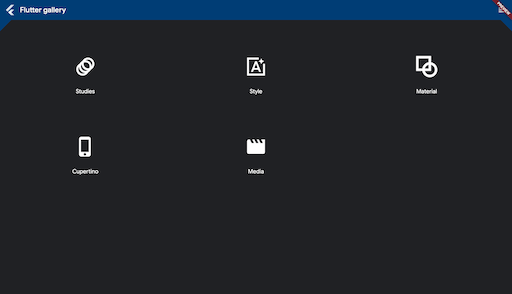

# Awesome-Flutter-Web

Despite being under the beta stage (27.01.2020), Flutter Web might show you pretty impressive web apps. Take a look at some of them.

If you want to share any of web apps that were written in Flutter, please send a PR.

- [Flutter Web Demo](http://minikin.me/flutter-web-demo/#/) - https://github.com/minikin/flutter-web-demo

- [Flutter Samples](https://flutter.github.io/samples/#/)

- [Flutter Web Demo](https://flutter-web-demo.firebaseapp.com/#/)

- [Flutter Raytracing](https://modulovalue.com/flutter_raytracing/#/) https://github.com/modulovalue/flutter_raytracing

- Flutter Web Example - https://github.com/kenreilly/flutter-web-example

- [Flutter Corsdetector](http://neevashramdial.me/furniture-flutter-web/#/) - https://github.com/mikegazzaruso/flutter_corsdetector

